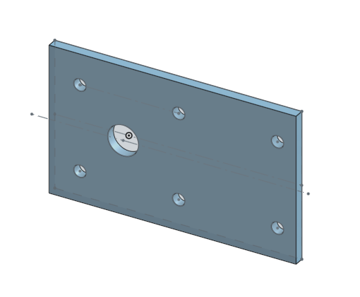
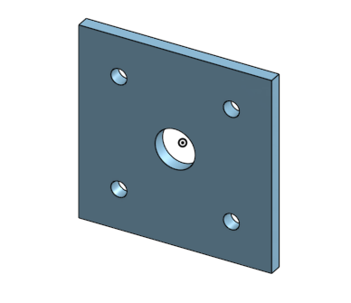

# BasicCAD 

---

## Assignments

## Caster base

### Description:
I have started the caster project by making a rectangle base using onshape. 

### Evidence:
https://cvilleschools.onshape.com/documents/bd4fbe6255df68f22ceec275/w/f51d09f4818101369146c124/e/77892d0d931d92e8632d5f10

### Picture: 

### Reflection:
I learned how to do the fundamentals of OnShape with this assignment. It also really gave me a feel for all of the keybinds and shortcuts. While this assignment wasn't very advanced it was pretty hard at first for someone who's never touched OnShape. The biggest problem I had with this assignment was probably the linear patters because it was different from solidworks where in OnShape you have to set it to a feature pattern.

## Caster Mount

### Description:
The Caster Mount is a square piece that has holes that allign with the base and connects with base to hold the Caster together.

### Evidence:
https://cvilleschools.onshape.com/documents/bd4fbe6255df68f22ceec275/w/f51d09f4818101369146c124/e/77892d0d931d92e8632d5f10

### Picture: 

### Reflection:
I learned how to make parts off of other parts with this assignment. I was able to us the base and just add a line to make i into a square and extrude that off the base in order to make the mount. This assignment was the true definition of work smarter not harder. This assignment also helped me master patterns because in the last assignment I had major issues with patterns.

## Caster Fork

### Description:
The Caster Fork is a piece made to hold the wheel together attached with the mount and base. It's shaped like an electrical plug.

### Evidence:
https://cvilleschools.onshape.com/documents/bd4fbe6255df68f22ceec275/w/f51d09f4818101369146c124/e/77892d0d931d92e8632d5f10

### Picture: 

### Reflection:
This assignment gave me a true understanding on how to use fillets in OnShape. I used a fillet to round out all of the edges of the fork. This is so imporant because part of the engineer's responsibility is not only to make something that works, but to also make something that looks good. Knowing how to fillet also helps with rough and sharp edges.
