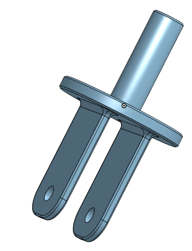
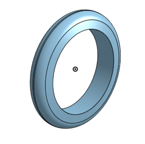
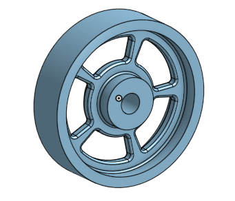
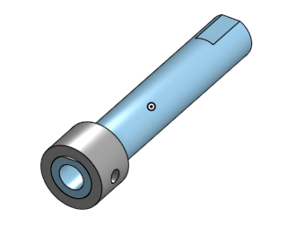
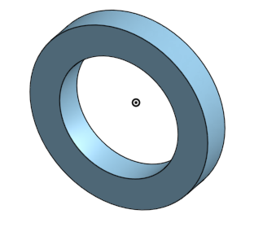

# BasicCAD 

---

## Assignments

## Caster base

### Description:
I have started the caster project by making a rectangle base using onshape. 

### Evidence:
https://cvilleschools.onshape.com/documents/bd4fbe6255df68f22ceec275/w/f51d09f4818101369146c124/e/77892d0d931d92e8632d5f10

### Picture: 

### Reflection:
I learned how to do the fundamentals of OnShape with this assignment. It also really gave me a feel for all of the keybinds and shortcuts. While this assignment wasn't very advanced it was pretty hard at first for someone who's never touched OnShape. The biggest problem I had with this assignment was probably the linear patters because it was different from solidworks where in OnShape you have to set it to a feature pattern.

## Caster Mount

### Description:
The Caster Mount is a square piece that has holes that allign with the base and connects with base to hold the Caster together.

### Evidence:
https://cvilleschools.onshape.com/documents/bd4fbe6255df68f22ceec275/w/f51d09f4818101369146c124/e/77892d0d931d92e8632d5f10

### Picture: 

### Reflection:
I learned how to make parts off of other parts with this assignment. I was able to us the base and just add a line to make i into a square and extrude that off the base in order to make the mount. This assignment was the true definition of work smarter not harder. This assignment also helped me master patterns because in the last assignment I had major issues with patterns.

## Caster Fork

### Description:
The Caster Fork is a piece made to hold the wheel together attached with the mount and base. It's shaped like an electrical plug.

### Evidence:
https://cvilleschools.onshape.com/documents/bd4fbe6255df68f22ceec275/w/f51d09f4818101369146c124/e/77892d0d931d92e8632d5f10

### Picture: 

### Reflection:
This assignment gave me a true understanding on how to use fillets in OnShape. I used a fillet to round out all of the edges of the fork. This is so imporant because part of the engineer's responsibility is not only to make something that works, but to also make something that looks good. Knowing how to fillet also helps with rough and sharp edges.

## Caster Tire

### Description:
The Caster Tire is a ring shaped piece that goes around the the caster wheel and is used for gripping what the wheel rolls on.

### Evidence:
https://cvilleschools.onshape.com/documents/bd4fbe6255df68f22ceec275/w/f51d09f4818101369146c124/e/77892d0d931d92e8632d5f10

### Picture: 

### Reflection:
This assignment taught me how to use the revolve tool. In order to get the curve the tire has I has to revolve it around an axis order for it to be completely round. This wasn't too challenging because it was practically the same as revolving in solidworks but the hard part about ths assignment was drawing the sketch for it. I had to figure out a shape that revole into a tire shape. The fun part of this assignment was using fillets to make it look like an actual tire.

## Caster Wheel

### Description:
The Caster Tire is a ring shaped piece that goes around the the caster wheel and is used for gripping what the wheel rolls on.
The Caster Wheel is connected to the fork and axle and has a tire around it allowing the wheel to roll on ground when fully assembled.

### Evidence:
https://cvilleschools.onshape.com/documents/bd4fbe6255df68f22ceec275/w/f51d09f4818101369146c124/e/77892d0d931d92e8632d5f10

### Picture: 

### Reflection:
This assignment taught me how to smart dimensions with angles. I had to use a 30 degree angle to smart dimensions two connecting side making an angle. After this I used a fillet on the wheel to give it a nice wheel. Finally I used a circular pattern in order to copy the patter 5 times all around make a cool look on the wheel. The hardest part about making this was getting the right numbers on the fillet because they were all so oddly curved.

## Caster Axle, Collar, and Bearing

### Description:
The Caster Axle, Collar, and Bearinf are all small parts that keep the entire wheel in place and makes sure it doesn't get undone while rolling the wheel against the ground.

### Evidence:
https://cvilleschools.onshape.com/documents/bd4fbe6255df68f22ceec275/w/f51d09f4818101369146c124/e/77892d0d931d92e8632d5f10

### Picture: 

### Reflection:
This assignment Was generally small but I did learn one very useful tool and it was called an extrusion cut. It's when you use the extrude tool and extrude into what you want to cut and set it to remove to extrude cut things. I used this tool on the Axle and the way I made the collar was I used the Axle as an inner circle and extrude it with an outer circle making a collar. The bearing was simple, it wa just two circles extruded.
